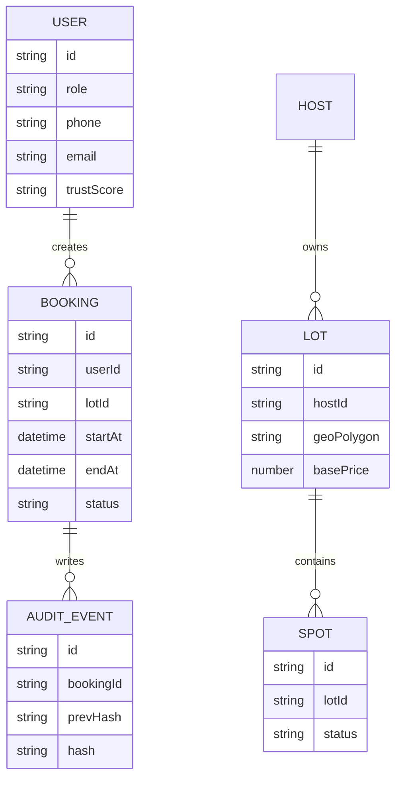

# MongoDB (Operational)



# Firestore (Realtime)

```mermaid
graph TD
  A[realtime/lotAvailability/{lotId}] --> B[currentOccupancy]
  A --> C[freeSpots]
  D[realtime/bookingStatus/{bookingId}] --> E[state]
  D --> F[lastGuardScan]
  G[auditChain/{bookingId}/events/{eventId}] --> H[hash]
  G --> I[prevHash]
```
